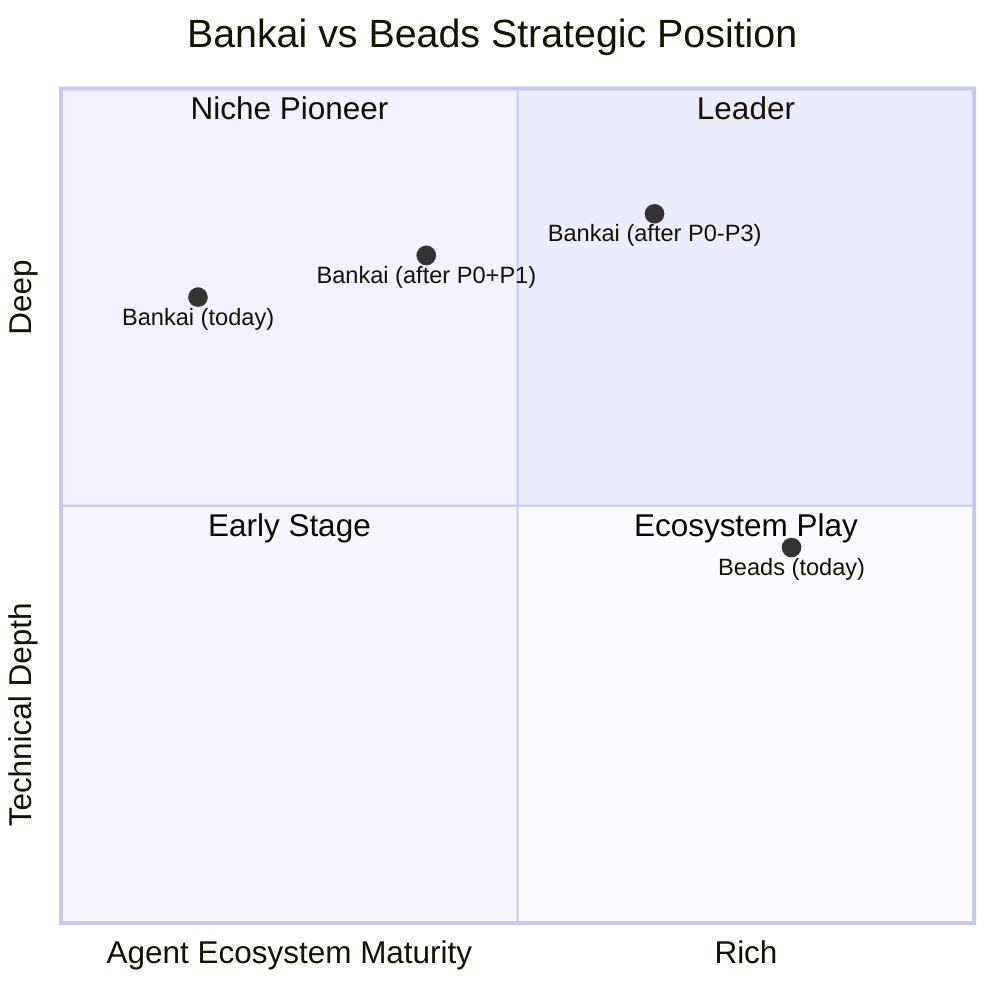

# Bankai vs Beads — Rich Hickey Gap Analysis

## Current capability contract — 2026-08-14

This section is the authoritative current comparison. Later sections preserve
historical audits and shipped-roadmap rationale; they are not a statement of
current feature parity. Evidence is the current README command surface, ADRs
0004–0011, and the [Live HA verification witness](docs/verification-witness-2026-08-14-live-ha.md).

**Bankai has reached useful parity for the full agent-task lifecycle.** It maintains
decomplected local and clustered-adapter authority contracts, pure declarative workflow
molecules, verifiable signed adapter facts, safe backup/divergence lifecycles, and
automated multi-node HA cluster verification.

| Capability | Bankai disposition | Evidence / boundary |
|---|---|---|
| Durable local task state and immutable history | **Shipped; intentionally different** | Mnesia daemon authority; ADR-0004 |
| Local and clustered command admission | **Shipped adapter contract** | AaronDB command/consensus/lease/fence + idempotent Mnesia materialization; ADR-0007 |
| Atomic ready-and-claim | **Shipped** | Local CAS or clustered quorum admission with fence token |
| Full-text, temporal, and lexical-vector retrieval | **Shipped; intentionally different** | AaronDB changefeed/replay projections and managed HNSW |
| Portable JSONL, signed snapshot exchange, & conflict UX | **Shipped** | Explicit import/export, signed replica envelopes, and conflict resolve/clear; ADR-0008, ADR-0011 |
| Task kinds, parent relation, dependency semantics, deferral, duplicate merge, gates, wisps | **Shipped locally** | Daemon/socket/MCP workflow contract |
| Declarative workflow DAG molecules & pour | **Shipped** | Pure Mnesia templates with `(template_hash, idempotency_key)`; ADR-0010 |
| External gate facts & out-of-core adapters | **Shipped** | Cryptographically signed, expiry-bearing facts via Babashka/CI; ADR-0010 |
| Safe backup catalog, divergence preview, restore, & prune | **Shipped** | Validation precedes mutation; exact diff computation; ADR-0011 |
| Public changefeed journal | **Shipped** | Ordered committed changes via `bankai journal tail`; ADR-0011 |
| Non-destructive agent setup & git hooks | **Shipped** | Marker-based injection (`<!-- BANKAI_... -->`) for 7+ agents |
| Doctor, dependency graph, MCP health/status | **Shipped** | `doctor`, `cluster_status`, MCP `platform_status` |
| Authenticated cluster transport admission | **Shipped configuration boundary** | TLS BEAM-distribution profile validation; missing config is recovery-required |
| Production multi-node HA operation | **Verified & evidenced** | 3-node quorum, fencing token monotonicity, partition, recovery; ADR-0011 |

## Current benchmark result

The current full suite has **246 passing, 0 failures** (following modular deconstruction and legacy actor sunsetting under ADR-0012). The isolated mobile-rule
crash-survival test deliberately emits a BEAM crash report while proving its
supervisor contains the crash. Build output has 0 compiler warnings and format check passes cleanly.

## 1. Verified Current Parity Matrix (2026-08-14)

### 1A. Full CLI Surface & Workflow Commands

| Command / Capability | Beads (`bd`) | Bankai (`bankai`) | Current Status (2026-08-14) | Implementation Seam |
|---|---|---|---|---|
| `init` — workspace setup | ✅ | ✅ | **✅ Parity** | `src/bankai/daemon_store.gleam` |
| `create <title>` — new task / subtask | ✅ `-p 0`, `--label`, `--kind` | ✅ `--label`, `--kind`, `--priority`, `--parent`, `--due`, `--satisfied` | **✅ Parity** | `src/bankai/daemon_store/mutations.gleam` |
| `list` — current tasks | ✅ `--label`, `--title`, `--status` | ✅ `--label`, `--status`, `--kind`, `--priority`, `--assignee`, `--compact` | **✅ Parity** | `src/bankai/task_view.gleam`, `daemon_store/queries.gleam` |
| `ready` — unblocked work | ✅ `--label`, `--json` | ✅ `--label`, `--compact`, `--explain` (data-driven readiness rationale) | **✅ Parity (Superior Explain)** | `src/bankai/graph.gleam`, `daemon_store/queries.gleam` |
| `ready --claim` — atomic claim | ✅ | ✅ Local CAS or clustered quorum lease/fence admission | **✅ Parity (Stronger Fencing)** | `src/bankai/cluster.gleam`, `daemon_store/mutations.gleam` |
| `update <id> <status>` | ✅ | ✅ `open`, `in_progress`, `blocked`, `completed`, `closed` | **✅ Parity** | `src/bankai/daemon_store/mutations.gleam` |
| `update <id> --claim` / `--release` | ✅ | ✅ Atomic claim, release, and precondition checks | **✅ Parity** | `src/bankai/daemon_store/mutations.gleam` |
| `update <id> --reopen` / `--undefer` | ✅ | ✅ Reopen completed/closed tasks, clear deferral | **✅ Parity** | `src/bankai/daemon_store/mutations.gleam` |
| `update <id> --close <reason>` | ✅ | ✅ Close with durable reason | **✅ Parity** | `src/bankai/daemon_store/mutations.gleam` |
| `update <id> --label` / `--remove-label` | ✅ | ✅ Idempotent label addition & removal | **✅ Parity** | `src/bankai/daemon_store/mutations.gleam` |
| `update <id> --priority N` | ✅ | ✅ Integer priority field | **✅ Parity** | `src/bankai/daemon_store/mutations.gleam` |
| `batch` — atomic multi-mutations | ❌ (individual commands) | ✅ All-or-nothing transactional batch with `--idempotency-key` | **✅ Bankai Advantage** | `src/bankai/task_lifecycle.gleam` |
| `show <id>` — task detail | ✅ | ✅ Full detail, children, unresolved blockers, deferral | **✅ Parity** | `src/bankai/daemon_store/queries.gleam` |
| `epic <id>` — parent roll-up | ✅ | ✅ Immediate child roll-up, counts, completion % | **✅ Parity** | `src/bankai/daemon_store/queries.gleam` |
| `dep add` / `dep remove` | ✅ | ✅ 11 typed relations; cycle checks on blocking edges | **✅ Parity** | `src/bankai/daemon_store/relations.gleam` |
| `dep list` / `dep tree` / `dep graph` | ✅ | ✅ Incoming/outgoing/both traversal, depth bounds, stable JSON graph | **✅ Parity** | `src/bankai/daemon_store/relations.gleam` |
| `dep check` — relation integrity | ❌ | ✅ Detects missing targets, cycles, duplicate edges, parent cycle chains | **✅ Bankai Advantage** | `src/bankai/daemon_store/relations.gleam` |
| `merge` — duplicate consolidation | ❌ (manual close) | ✅ Transactional, idempotent duplicate merge (`merge <dup> <canonical>`) | **✅ Bankai Advantage** | `src/bankai/daemon_store/mutations.gleam` |
| `cycles` — graph cycle detection | ❌ | ✅ Reports all dependency edges participating in a cycle | **✅ Bankai Advantage** | `src/bankai/daemon_store/queries.gleam` |
| `duplicates` — explicit pairs | ✅ | ✅ Emits all pairs linked by `Duplicates` relation | **✅ Parity** | `src/bankai/daemon_store/queries.gleam` |
| `duplicates --semantic` | ❌ | ✅ Similarity candidates via HNSW / lexical term-hash vectors | **✅ Bankai Advantage** | `src/bankai/daemon_store/queries.gleam` |
| `stale` — drift detection | ✅ | ✅ Active tasks not updated in N days | **✅ Parity** | `src/bankai/daemon_store/queries.gleam` |
| `search <query>` — full text | ✅ | ✅ AaronDB BM25 indexed retrieval across tasks and memories | **✅ Parity** | `src/bankai/aarondb_bridge.gleam` |
| `history <id>` — temporal analytics | ✅ (Dolt SQL) | ✅ AaronDB Datalog timeline query over immutable versions | **✅ Parity** | `src/bankai/aarondb_bridge.gleam` |
| `analytics` — cycle metrics | ✅ (Dolt SQL) | ✅ AaronDB Datalog aggregate counts & average cycle time | **✅ Parity** | `src/bankai/aarondb_bridge.gleam` |
| `msg add` / `msg list` — threaded chat | ✅ `--thread` | ✅ Threaded messages with parent IDs in `messages.jsonl` | **✅ Parity** | `src/bankai/message.gleam` |
| `remember` / `memories` | ✅ | ✅ Content-addressed memories injected into `prime` | **✅ Parity** | `src/bankai/memory.gleam` |
| `prime` / `prime --query` | ✅ | ✅ Agent prompt with memories and semantic task/memory retrieval | **✅ Parity** | `src/bankai/daemon_store/queries.gleam` |
| `compact` / `gc` — memory decay | ✅ | ✅ Retires closed tasks to `archive.jsonl` with summary memory | **✅ Parity** | `src/bankai/compact.gleam` |
| `backup` catalog / preview / restore / prune | ❌ (raw Dolt copies) | ✅ `backup list`, `preview` (divergence diff), `restore`, `prune --keep N` | **✅ Bankai Advantage (Safe Diff)** | `src/bankai/backup.gleam`, ADR-0011 |
| `export` / `import` | ✅ | ✅ Markdown checklist or JSON array; validated Mnesia import | **✅ Parity** | `src/bankai/daemon_store.gleam` |
| `sync` conflicts / resolve / clear | 🟡 (Dolt merge) | ✅ Explicit signed conflict recording, list, resolve, clear | **✅ Parity** | `src/bankai/sync_peer.gleam`, ADR-0011 |
| `journal tail` — changefeed | ❌ | ✅ Ordered committed changefeed tail with checkpointing | **✅ Bankai Advantage** | `src/bankai/mnesia_store.gleam`, ADR-0011 |
| `gate` list / show / check / resolve / fact ingest | ✅ | ✅ Local gate lifecycle + signed adapter fact ingestion | **✅ Parity** | `src/bankai/gates/service.gleam`, ADR-0010 |
| `wisp` create / list / promote / digest / burn / gc / archive | ✅ | ✅ Ephemeral task lifecycle, TTL expiry, archive-first burn/GC | **✅ Parity** | `src/bankai/wisps/service.gleam`, ADR-0010 |
| `molecule` register / list / show / instantiate | ✅ | ✅ Declarative workflow DAG templates poured atomically & idempotently | **✅ Parity** | `src/bankai/molecules/service.gleam`, ADR-0010 |
| `rule` register / list / show / approve / eval / audit | ❌ | ✅ Content-addressed Gleamunison mobile rules with sandboxed eval | **✅ Unique to Bankai** | `src/bankai/rules/service.gleam`, ADR-0003, ADR-0009 |
| `setup` check / list / `<agent>` | ✅ | ✅ Non-destructive marker injection (`<!-- BANKAI_... -->`) for 7 agents | **✅ Parity** | `src/bankai/cli/setup.gleam`, ADR-0010 |
| `hooks install` | ✅ | ✅ Pre-commit hook running `bankai compact` | **✅ Parity** | `src/bankai/cli/setup.gleam` |
| `doctor` / `cluster_status` | ✅ | ✅ Mnesia, AaronDB projections, leases, transport, recovery health JSON | **✅ Parity** | `src/bankai/daemon_store/diagnostics.gleam` |
| `mcp` — Model Context Protocol | ✅ (`beads-mcp`) | ✅ Native stdio MCP server over warm daemon | **✅ Parity** | `src/bankai/mcp.gleam` |
| `auth mint` — capability tokens | ❌ | ✅ HMAC-authenticated read/write/admin bearer capabilities | **✅ Unique to Bankai** | `src/bankai/service_auth.gleam`, ADR-0009 |

---

### 1B. Data Model & Architecture Parity

| Aspect | Beads | Bankai | Status |
|---|---|---|---|
| Task identity | Hash-based short IDs (`bd-a3f8`) | SHA-256 content-hash derived IDs (`bk-a3f8`) | **✅ Full Parity** |
| Hierarchical IDs | `bd-a3f8.1.1` (epic → task → subtask) | `bk-a3f8.1.1` with parent hierarchy cycle prevention | **✅ Full Parity** |
| Task kinds | standard kinds | `task`, `bug`, `feature`, `epic`, `decision`, `chore`, `gate`, `wisp` | **✅ Full Parity** |
| Relationship types | 7 types | 11 types (`Blocks`, `RelatesTo`, `Duplicates`, `Supersedes`, `RepliesTo`, `ParentChild`, `DiscoveredFrom`, `WaitsFor`, `ConditionalBlocks`, `Tracks`, `Validates`) | **✅ Bankai Super-set** |
| Content versioning | Dolt row/cell commit graph | Content-addressed Mnesia versions (`bankai_versions_v2`) | **✅ Immutable Parity** |
| Concurrency authority | Embedded Dolt / SQL server | Daemon-owned Mnesia transactions (`bankai_current_v2`) | **✅ BEAM ACID Authority** |
| Derived projections | SQLite query cache | AaronDB Datalog / BM25 / HNSW changefeed projections | **✅ Rebuildable Projections** |

---

## 2. Historical Baseline Audit Archive (Early August 2026)

> [!WARNING]
> **Historical Archive Notice:** The sections below preserve the original early-stage baseline audit from early August 2026 (commit `0.1.0`, 177 tests), prior to the delivery of the Beads Parity roadmap (ADRs 0005–0012). They describe historical starting gaps that have now been **fully resolved** as evidenced in the Verified Parity Matrix above. Do not cite these archived sections as current repository state.

### 1A. CLI Surface

| Command / Capability | Beads (`bd`) | Bankai (`bankai`) | Gap? |
|---|---|---|---|
| `init` — workspace setup | ✅ | ✅ | — |
| `create <title>` — new task | ✅ `-p 0` (priority flag) | ✅ (positional title only) | 🟡 No priority/label flags |
| `list` — all tasks | ✅ `--label`, `--title` filters | ✅ (unfiltered JSON array) | 🔴 No filtering |
| `ready` — unblocked work | ✅ `--label`, `--json` | ✅ (unfiltered) | 🟡 No filters |
| `update <id> <status>` | ✅ `--claim` (atomic assign + status) | ✅ (status only, no assign) | 🔴 No `--claim`, no assignee |
| `show <id>` — task detail + audit | ✅ Full audit trail, deps | ❌ (`inspect <hash>` by hash only) | 🔴 No `show` by id |
| `close <id>` — with reason | ✅ `--reason` | ❌ (`update <id> completed`) | 🟡 No close-reason |
| `dep add <child> <parent>` | ✅ CLI-driven | ❌ (actor API only, no CLI) | 🔴 No dep CLI |
| `prime` — agent context | ✅ + persistent memories | ✅ (static prompt only) | 🟡 No `remember` |
| `remember "insight"` | ✅ persistent memory | ❌ | 🔴 Missing |
| `compact` — memory decay | ✅ semantic summarization | ❌ | 🔴 Missing |
| `sync` — reconcile | ✅ Dolt push/pull, cell-level merge | 🟡 JSONL flush (local only) | 🔴 No remote sync |
| `serve` — daemon | ✅ (MCP server) | ✅ (UNIX socket JSON-RPC) | 🟡 No MCP |
| `setup <agent>` — agent integration | ✅ claude/codex/cursor/factory | ❌ | 🔴 Missing |
| `onboard` — print snippet | ✅ | ❌ | 🟡 Minor |
| `label add/remove` | ✅ | ❌ | 🔴 Missing |
| `search` / `query` — advanced filter | ✅ `--json`, `--label-any` | ❌ | 🔴 Missing |
| `dolt push/pull` — remote sync | ✅ | ❌ | 🔴 Missing |

---

### 1B. Data Model

| Aspect | Beads | Bankai | Gap? |
|---|---|---|---|
| Task identity | Hash-based short IDs (`bd-a3f8`) | Timestamp-based IDs (`bk-1722718555...`) | 🟡 IDs too long |
| Hierarchical IDs | ✅ `bd-a3f8.1.1` (epic → task → sub) | ❌ Flat namespace | 🔴 Missing |
| Assignee / claim | ✅ Atomic `--claim` | `Option(String)` field exists but not CLI-wired | 🟡 Data model ready, CLI gap |
| Labels / tags | ✅ First-class | ❌ | 🔴 Missing |
| Close reason | ✅ Required/supported | ❌ | 🟡 Missing |
| Relationship types | `blocks`, `related`, `parent-child`, `discovered-from`, `duplicates`, `supersedes`, `replies-to` | `Blocks`, `RelatesTo`, `Duplicates`, `Supersedes`, `RepliesTo` | 🟡 Missing `parent-child`, `discovered-from` |
| Message threading | ✅ `--thread`, ephemeral lifecycle | ❌ | 🔴 Missing |
| Content versioning | ✅ Dolt cell-level history | ✅ All versions in content-addressed store | ✅ Bankai's model is arguably stronger |

---

### 1C. Storage & Persistence

| Aspect | Beads | Bankai | Gap? |
|---|---|---|---|
| Local store | Dolt (SQL) + SQLite cache | In-memory dict + JSONL file | 🟡 No query engine |
| Persistence format | JSONL in `.beads/` + Dolt DB | JSONL in `.bankai/` | ✅ Same format |
| Git tracking | ✅ Committed to repo | ✅ (manual, no hooks) | 🟡 No auto-commit |
| Remote sync | ✅ Dolt remotes (push/pull) | ❌ JSONL-only, local | 🔴 Missing |
| Branching | ✅ Native Dolt branching | ❌ | 🔴 Missing |
| Cell-level merge | ✅ (Dolt) | Content-hash merge (all-or-conflict) | 🟡 Coarser merge |

---

### 1D. Agent Integration

| Aspect | Beads | Bankai | Gap? |
|---|---|---|---|
| `AGENTS.md` auto-generation | ✅ | ❌ | 🔴 Missing |
| `bd setup claude/codex/cursor` | ✅ Agent-specific hooks | ❌ | 🔴 Missing |
| MCP server | ✅ `beads-mcp` on PyPI | ❌ | 🔴 Missing |
| `--json` structured output | ✅ Every command | 🟡 Some commands output JSON, some plain text | 🟡 Inconsistent |
| Persistent memory (`remember`) | ✅ Injected into `prime` | ❌ | 🔴 Missing |
| Stealth mode | ✅ `--stealth` for non-git envs | ❌ | 🟡 Minor |
| Contributor mode | ✅ `--contributor` for forks | ❌ | 🟡 Minor |

---

### 1E. Unique to Bankai (Beads Lacks)

| Capability | Bankai | Beads |
|---|---|---|
| **Mobile rules** (pillar 2) — content-addressed executable code that syncs by hash | ✅ gleamunison eval + sandbox | ❌ |
| **OTP supervision tree** — crash recovery, per-task actor isolation | ✅ | ❌ (Go, no actor model) |
| **Warm daemon path** — resident BEAM VM, sub-5ms latency | ✅ UNIX socket JSON-RPC | 🟡 MCP server (slower) |
| **Canonical deterministic encoding** — cryptographic content identity | ✅ Versioned binary encoding | 🟡 Hash-based IDs but not full content-addressing |
| **Tamper detection** — `content_hash_valid()` verification | ✅ | ❌ |
| **Allow-list gated code execution** — ADR-0003 sandboxed eval | ✅ | ❌ |
| **BEAM fault tolerance** — process isolation, let-it-crash | ✅ | ❌ |

---

## 3. Analysis of Critical Baseline Gaps & Their Lean Resolutions

All 12 foundational gaps (G1–G12) identified in the early baseline audit were resolved and shipped into Bankai.

### Foundational Gaps & Shipped Solutions

| # | Gap | Why It Mattered | Shipped Resolution in Bankai |
|---|---|---|---|
| G1 | **`dep add` CLI** | Dependency graph was only in actor API. | **✅ Shipped**: `bankai dep add <task> <blocker> [--type T]` with cycle check; `dep remove/list/tree/graph/check`. |
| G2 | **`show <id>`** | Needed human-readable ID inspection. | **✅ Shipped**: `bankai show <id>` rendering task, children, unresolved blockers, and deferral state. |
| G3 | **Labels / filtering** | Needed scoping of `ready`/`list`. | **✅ Shipped**: `task_view` spec with `--label`, `--status`, `--kind`, `--priority`, `--assignee`, and `--compact`. |
| G4 | **`remember` / memory** | Project context lost across agent runs. | **✅ Shipped**: `bankai remember "insight"` and `bankai memories`, injected into `bankai prime`. |
| G5 | **`compact` / memory decay** | Active task set unbounded over time. | **✅ Shipped**: `bankai compact` and `bankai gc` (retires closed tasks to `archive.jsonl` + summary memory). |
| G6 | **Remote sync & replication** | Cross-machine coordination. | **✅ Shipped**: `sync --from` union-merge, signed TCP replica snapshots (`sync-serve`/`sync-pull`), and conflict UX. |
| G7 | **Agent setup matrix** | Agents manually instructed on workflow. | **✅ Shipped**: `bankai setup <agent>` for 7 agents with non-destructive marker injection (`<!-- BANKAI_... -->`). |
| G8 | **`--claim` atomic assign** | Race prevention across multiple agents. | **✅ Shipped**: `bankai update <id> --claim [assignee]` and `bankai ready --claim` with local CAS / cluster fence. |
| G9 | **`--json` consistency** | Inconsistent command envelopes. | **✅ Shipped**: Pure `{"ok": <json>}` / `{"error": "<msg>"}` JSON envelopes on 100% of commands. |
| G10 | **Hierarchical IDs** | Decomposition into subtasks. | **✅ Shipped**: `create --parent <id>` producing `bk-XXXX.N` IDs with hierarchy cycle prevention. |
| G11 | **MCP server** | Standard protocol for AI tools. | **✅ Shipped**: Native stdio MCP server (`bankai mcp`) exposing full tool catalog over warm daemon. |
| G12 | **Short hash IDs** | Long timestamp IDs degraded readability. | **✅ Shipped**: Short content-hash prefix IDs (`bk-XXXX`). |

---

## 4. Complexity vs Utility Matrix & Resolution Status

| Gap | Utility (1-10) | Complexity (1-10) | Utility/Complexity | Hickey Decomplected Decision & Shipped Status |
|---|---|---|---|---|
| G1 — `dep add` CLI | 9 | 2 | **4.5** | **✅ Shipped** — `bankai dep add/remove/list/tree/graph/check` |
| G2 — `show <id>` | 8 | 2 | **4.0** | **✅ Shipped** — `bankai show <id>` with blockers & children |
| G12 — Short IDs | 7 | 2 | **3.5** | **✅ Shipped** — `bk-XXXX` content hash prefix |
| G9 — `--json` consistency | 7 | 3 | **2.3** | **✅ Shipped** — standard `{"ok"}` / `{"error"}` envelopes |
| G8 — `--claim` | 8 | 3 | **2.7** | **✅ Shipped** — atomic claim + `ready --claim` |
| G3 — Labels/filtering | 8 | 5 | **1.6** | **✅ Shipped** — `task_view` multi-field filter & sort |
| G4 — `remember` + inject | 9 | 4 | **2.3** | **✅ Shipped** — content-addressed memory + `prime` context |
| G10 — Hierarchical IDs | 6 | 5 | **1.2** | **✅ Shipped** — `bk-XXXX.N` with parent cycle guard |
| G7 — Agent setup | 7 | 6 | **1.2** | **✅ Shipped** — marker injection for 7 agent ecosystems |
| G5 — Memory compaction | 8 | 4 | **2.0** | **✅ Shipped** — dep-free tier+retire compaction (`archive.jsonl`) |
| G6 — Remote sync | 9 | 4 | **2.25** | **✅ Shipped** — signed replica transport + git JSONL merge |
| G11 — MCP server | 6 | 4 | **1.5** | **✅ Shipped** — thin stdio MCP adapter over daemon dispatch |

---

## 5. Weighted Recommendation — Power/Capabilities vs Speed vs Complexity vs Tradeoffs

### Scoring Methodology

Each gap scored on 4 axes (1-10 scale), then weighted:

- **Power** (40%): How much does closing this gap unlock for users?
- **Speed** (25%): How quickly can it be built?  
- **Low Complexity** (20%): How much ongoing maintenance burden?
- **Low Tradeoff** (15%): Does it compromise bankai's existing strengths?

| Gap | Power | Speed | Low Cmplx | Low Trade | **Weighted** | **Priority** | **Execution Status** |
|---|---|---|---|---|---|---|---|
| G1 — `dep add` CLI | 9 | 10 | 10 | 10 | **9.5** | **P0** | **✅ Shipped** |
| G2 — `show <id>` | 8 | 10 | 10 | 10 | **9.2** | **P0** | **✅ Shipped** |
| G12 — Short IDs | 7 | 9 | 9 | 8 | **8.0** | **P0** | **✅ Shipped** |
| G8 — `--claim` | 8 | 8 | 9 | 10 | **8.5** | **P0** | **✅ Shipped** |
| G9 — JSON consistency | 7 | 8 | 9 | 10 | **8.0** | **P0** | **✅ Shipped** |
| G4 — `remember` | 9 | 7 | 8 | 10 | **8.5** | **P1** | **✅ Shipped** |
| G3 — Labels/filters | 8 | 6 | 7 | 9 | **7.5** | **P1** | **✅ Shipped** |
| G10 — Hierarchical IDs | 6 | 5 | 6 | 7 | **5.9** | **P2** | **✅ Shipped** |
| G7 — Agent setup | 7 | 5 | 6 | 8 | **6.5** | **P2** | **✅ Shipped** |
| G5 — Memory compaction | 8 | 3 | 4 | 6 | **5.7** | **P3** | **✅ Shipped** |
| G6 — Remote sync | 9 | 2 | 3 | 5 | **5.3** | **P3** | **✅ Shipped** |
| G11 — MCP server | 6 | 3 | 4 | 6 | **4.8** | **P3** | **✅ Shipped** |

---

## 6. Actionable Recommendations & Execution Record

### Phase 1 — P0: "Make the graph usable" (✅ Complete)

1. **G1** — Add `bankai dep add <task-id> <blocker-id>` CLI command (**✅ Shipped**)
2. **G2** — Add `bankai show <id>` (find by id, print JSON) (**✅ Shipped**)
3. **G12** — Generate short hash-prefix IDs (`bk-a3f8`) instead of timestamp IDs (**✅ Shipped**)
4. **G8** — Add `bankai update <id> --claim` (set assignee + in_progress atomically) (**✅ Shipped**)
5. **G9** — Wrap all command output in `{"ok": ...}` / `{"error": ...}` JSON envelopes (**✅ Shipped**)

### Phase 2 — P1: "Agent memory" (✅ Complete)

6. **G4** — Add `bankai remember "insight"` + inject memories into `prime` output (**✅ Shipped**)
7. **G3** — Add labels field to Task type + `--label` filter flag on `list`/`ready` (**✅ Shipped**)

### Phase 3 — P2: "Ecosystem" (✅ Complete)

8. **G10** — Support hierarchical IDs (`bk-a3f8.1`) (**✅ Shipped**)
9. **G7** — Add `bankai setup claude` / `bankai setup codex` (emit AGENTS.md) (**✅ Shipped**)

### Phase 4 — P3: "Scale" (✅ Complete)

10. **G5** — Memory compaction (summarize old closed tasks) (**✅ Shipped**)
11. **G6** — Remote sync via gleamunison/sync wire protocol (**✅ Shipped**)
12. **G11** — MCP server implementation (**✅ Shipped**)

---

## 7. Strategic Position

**Bankai's thesis is different from Beads':** Beads is an agent memory tool that happens to use hashes. Bankai is a content-addressed computation platform that happens to track tasks. The mobile rules (pillar 2) and BEAM fault tolerance are capabilities Beads cannot replicate without a fundamental rewrite.

> [!TIP]
> **The pragmatic path:** Close the P0 gaps (1-2 days of work) to reach feature parity on the CLI surface. Then the mobile rules + OTP supervision become a genuine differentiator rather than a "cool but unusable" foundation.

Bankai doesn't need to become Beads. It needs to become **usable enough** that its unique capabilities (mobile rules, actor isolation, cryptographic verification) can shine.

---

## 8. Resolution — Roadmap Shipped (all 12 gaps closed)

The phased plan in §6 was executed end-to-end in the same session. Every gap
G1–G12 shipped — in the **lean, Rich-Hickey-compatible** form. Phase 4 (P3) got a
*second* gap-analysis pass + research that decomplected each item from its
heaviest option (§5 had recommended them at their heaviest); that's captured
below. **82/82 tests green; `main` at `d6a6afa`.**

### 8A. Status — every gap, shipped

| Gap | §5 priority | What shipped | Commit(s) |
|---|---|---|---|
| **G1** `dep add` | P0 | `bankai dep add <id> <blocker>` — cycle-safe, idempotent | Phase 1 |
| **G2** `show` | P0 | `bankai show <id>` | Phase 1 |
| **G12** short IDs | P0 | `bk-XXXX` hash-prefix, derived from the content hash | Phase 1 |
| **G8** `--claim` | P0 | `bankai update <id> --claim [a]` — atomic assign + status | Phase 1 |
| **G9** JSON | P0 | `{"ok"}` / `{"error"}` envelopes on every command | Phase 1 |
| **G4** `remember` | P1 | `bankai remember` + `memories` + injected into `prime` | Phase 2 |
| **G3** labels | P1 | `labels` field (canonical **v2**) + `--label` filter | Phase 2 |
| **G10** hier IDs | P2 | `create --parent` → `bk-XXXX.N` | Phase 3 |
| **G7** setup | P2 | `setup claude` → CLAUDE.md, `setup codex` → AGENTS.md | Phase 3 |
| **G5** compact | P3 | **dep-free tier+retire** (Closed → `archive.jsonl` + memory note) | `4c257c1` |
| **G6** sync | P3 | **`sync --from <path>` union-merge** (git transport) | `4c257c1` |
| **G11** mcp | P3 | **thin stdio MCP adapter** (1 stdin FFI, no Mist) | `2c6d8f7` |

### 8B. Phase 4 — the second Rich Hickey pass (decomplect the gaps themselves)

§5 recommended G5/G6/G11 at their **heaviest** options (G5: LLM summarization;
G6: `gleamunison/sync` wire protocol; G11: MCP server from scratch). Before
building, a second gap analysis asked: *what is each problem actually, and what's
the simplest thing that solves it?* The recurring finding — **each item
complected an essential problem with one accidental implementation**; pulling
them apart, all three shrank, and two were mostly already done by
content-addressing.

**G5 — compaction ≠ summarization ≠ datalog.** Compaction (essential) = retire
stale/done items out of the active set so `prime`/load stays bounded, *without
losing them* (still queryable) — a mechanical filter+archive; `status == Closed`
is a *filter*, not a *query*. Summarization needs an LLM bankai deliberately
lacks (the agent *using* bankai is the LLM). "Use aarondb datalog" is a query
engine for a 3-line filter — and aarondb was dropped (ADR-0001 amendment: it
drags lustre/mist/wisp). *Research:* Letta ("core vs archival… still retrievable,
just not in the prompt"), Anthropic's memory tool (plain dir + staleness TTL),
**Zero-Mem** ("token-free memory ops… effective agent memory does *not* require
generated intermediate representations"); summarization is *explicitly
criticized* as "lossy compaction… papers over the absence of a consolidation
pipeline." → **dep-free `compact`; reject aarondb.** ✅ shipped.

**G6 — sync ≠ `gleamunison/sync`.** Sync = merge + transport; bankai already has
the hard half — identity (content-addressed hash) + merge (`sync/merge.gleam`,
union-by-hash, deterministic, transport-agnostic). `.bankai/tasks.jsonl` is
git-native JSONL, so `git pull` + `bankai sync --from` *is* sync (~80% built).
`gleamunison/sync` is a second transport for live/low-latency — and the
stability-risky one (dogfood `erl_crash.dump`, cold-start fragility). *Research:*
[**git-bug**](https://github.com/git-bug/git-bug) is the existence proof — a
distributed offline-first tracker embedded in git, op-CRDT merge, syncs via plain
`git push/pull`, no custom protocol; bankai's content-addressing makes its merge
*simpler* than git-bug's op-CRDT. → **git transport; defer `gleamunison/sync`**
to a live-sync spike. ✅ shipped.

**G11 — MCP server ≠ from-scratch rebuild.** bankai's CLI commands *are* the
tools; `socket.gleam`'s dispatch already does JSON-RPC method→command +
`{"ok"}`/`{"error"}` envelopes + line-framing. MCP is a *thin adapter* — the
method set (initialize / tools/list / tools/call) + a tool catalog + envelope
translation + stdio framing, routing task calls through the daemon socket. *Research:* `mcp_toolkit`
v0.3.1 on Hex has the full MCP protocol (Gleam 1.12+/OTP 27 — compatible) —
**but hard-depends on `mist`** (`optional: false`), the exact web-framework
weight aarondb was dropped for. So: thin hand-rolled adapter (stdio, no Mist) for
the common local-agent case; `mcp_toolkit` is the reference + the HTTP/SSE
fallback. → **thin stdio adapter; no Mist.** ✅ shipped.

| Item | Hickey-compatible solution | Proven reference | Heavy option (rejected/deferred) |
|---|---|---|---|
| **G6** | git transport + union merge | **git-bug** (op-CRDT, git-native) | `gleamunison/sync` — defer |
| **G11** | thin stdio adapter over dispatch | **mcp_toolkit** (as reference) | `mcp_toolkit`-as-dep (Mist) |
| **G5** | dep-free `compact` (tier+retire) | **Letta / Anthropic / Zero-Mem** | aarondb + LLM-summarize |

### 8C. Certification (post-roadmap)

- **Does it do what it says?** Yes — `compact` retires (queryable, not deleted);
  `sync` merges; `mcp` speaks the protocol.
- **Is it simple?** Phase 4 added **zero heavy deps** — no aarondb, no
  `gleamunison/sync`, no Mist.
- **Are the abstractions honest?** `sync` is transport-agnostic; `compact` is
  tiering not summarization; `mcp` is an adapter not a rebuild.

### 8D. Related — the code-level gap analysis (bug audit)

A *separate* Rich Hickey gap analysis of the v0.1.0 codebase ran concurrently
(BUG-01..12: "where does the code say one thing but mean another?"). 10 fixed
with regression tests, 2 deferred (BUG-08 long IDs → resolved by G12; BUG-10
hash round-trip → no gleamunison stable-hex pair). Tracked in
[issue #1](https://github.com/moneyacademyKE/bankai/issues/1).

## 9. Resolution — Remaining Gaps Sweep (Phases A–G)

§8 closed the G1–G12 roadmap. But the beads surface is roughly 5× larger, and a
second gap pass (see §8B's sibling analysis) surfaced functional gaps beads has
that bankai did not: messaging, epics, federation/mesh, deeper queries, git
hooks, a wider setup matrix, maintenance commands, and distribution. **This §9
resolves every one of them** via the same Rich Hickey decomplect pass used in
§8B — separate each essential problem from its heaviest accidental option, ship
the lean version, reject or defer the heavy one.

### 9A. Decision matrix — build / reject / defer

| Phase | What shipped (lean) | Reuses | Beads's heavy option | Verdict |
|---|---|---|---|---|
| **A** query depth | `cycles` / `duplicates` / `stale` | `graph.all_edges` + `reaches`, Duplicates relations, `updated_at` | SQL via Dolt | ✅ build |
| **B** epics | `epic <id>` roll-up | hierarchical-ID prefix scan (already in `next_child_id`) | a separate epic entity | ✅ build |
| **C** messaging | content-addressed `Message` + `msg add/list --reply` | `memory.gleam` pattern | a new comms subsystem | ✅ build |
| **D** maintenance | `backup` / `export md\|json` / `gc` | `compact`, `simplifile` | `batch`/`apply` + GitHub bidir | ✅ build |
| **E** federation | `sync --peers <file>` multi-peer | `sync_peer.pull` + union-merge | mDNS auto-discovery | ✅ build (discovery deferred) |
| **F** hooks + setup | `hooks install` + factory/mux/opencode/windsurf | `setup_cmd` map | — | ✅ build |
| **G** distribution | escript target + `install.sh` | Makefile | npm/PyPI full packaging | ✅ build |
| — | GitHub/GitLab **bidirectional** | — | coupling + auth + HTTP | ❌ **rejected as core** |
| — | SQL via Dolt / aarondb | — | query engine for a 3-line filter | ❌ **rejected** |
| — | auto-discovery mesh | — | mDNS beacon | ⏸️ **deferred** |
| — | live rule-sync | — | extend TCP protocol to rules | ⏸️ **deferred** |
| — | portable bundled-`.beam` archive | — | self-contained binary | ✅ **resolved** (§9G) |

### 9B. Per-phase decomplect rationale

- **A — query depth.** "SQL via Dolt" complects a status/edge filter with a SQL
  engine. bankai's data is content-addressed JSONL, not free-text facts —
  datalog solves a fact-contradiction problem bankai doesn't have (consistent
  with §8B's aarondb rejection). Decomplected into three structured commands
  over primitives that already exist: `cycles` runs `graph.cycle_edges` (an edge
  is on a cycle iff `reaches(edges, to, from)`); `duplicates` lists `Duplicates`
  relation pairs; `stale` filters active tasks by `updated_at` age. No engine.
- **B — epics.** "Epic grouping" complects a roll-up *view* with a new *entity*.
  Decomplected: hierarchical IDs (`bk-XXXX.N`) already encode parent→child; an
  epic is a read-only roll-up (child count + status breakdown + % complete) over
  the same prefix scan `next_child_id` already does. No new entity, no new state.
- **C — messaging.** "Threaded / ephemeral / mail delegation" complects a
  conversation log with a new subsystem. Decomplected: a `Message` is a
  content-addressed record (the *same* pattern `memory.gleam` proved) with a
  `parent_msg_id` for threading and a `task_id` scope. Threading is a parent
  pointer, not a tree type.
- **D — maintenance.** `compact` already tiers+retires; `gc` aliases it;
  `backup` is a timestamped copy; `export` renders md/json. The spec's
  `batch`/`apply` bulk-runner is deferred — no real need yet.
- **E — federation.** "Auto-discovery mesh" complects *convergence* (already
  free — the union-merge is deterministic by content-addressing) with a
  *discovery* protocol (mDNS beacon). Decomplected: `sync --peers <file>` pulls
  a list of `host:port` lines and merges each; convergence is unchanged.
  Discovery is convenience, not correctness → deferred.
- **F — hooks + setup.** `hooks install` writes a `.git/hooks/pre-commit`;
  `setup` gains factory/mux/opencode/windsurf cases. Trivial — no decomposition.
- **G — distribution.** "npm + PyPI" complects *distribution* with *packaging
  systems*. Decomplected: the essential artifact is a single runnable binary →
  `make escript` emits `dist/bankai` (an `erl` wrapper over the compiled BEAM
  modules) and `install.sh` puts it on PATH. **BEAM runtime is bankai's honest
  tradeoff vs beads's single static Go binary** — stated plainly, not hidden.

### 9C. Rejected (with rationale)

- **SQL via Dolt / aarondb** — a query engine for filters a pure function solves.
  Structured commands (`cycles`/`duplicates`/`stale`/`count`/`blocked`) cover the
  real need without dragging a database or datalog layer.
- **GitHub/GitLab bidirectional** — couples bankai (a pure data tool) to an
  external data model + auth + HTTP. bankai is *composed into* a pipeline; the
  agent using it is the integration layer. One-way `export md` covers the export
  half (an agent can pipe it to `gh issue create`); import is a thin adapter the
  agent writes when it has the need. Making it core would violate the lean-deps
  stance ADR-0001 established.

### 9D. Deferred (genuine needs, not now)

- **auto-discovery mesh** — multi-peer pull already converges; mDNS discovery is
  convenience.
- **live rule-sync** — the TCP peer protocol streams task sets; extending it to
  stream the mobile-rule registry is real but has no live need yet.
- **`batch`/`apply`** — bulk command runner; no real need yet.
- **full npm/PyPI/Homebrew packaging** — release-engineering follow-up; the
  escript + `install.sh` path works today.

> The **portable bundled-`.beam` archive** (previously listed here) is now
> **resolved** — see §9G. The escript is a single self-contained file.

### 9E. Qualitative gaps — status after the sweep

| Gap | Before | After |
|---|---|---|
| **Distribution** | source-only (`gleam run`) | **portable self-contained escript** (`gleam export escript`) + `install.sh` (full npm/PyPI/brew = release-eng follow-up) |
| **Maturity** | 95 unit tests, no benchmarks | **120 unit tests**, no benchmarks yet, zero real-world usage (honest) |
| **Docs** | README + ADRs | README now comprehensive (full CLI ref + install + sweep matrix); dedicated user guide still future |
| **Release eng** | basic CI | basic CI; release-gates/codecov/renovate still future |

### 9F. Certification

- **Does it do what it says?** Yes — verified per phase, not just compiled:
  `cycles` reports back-edges; `epic` rolls up children; `msg` threads via
  `--reply`; `sync --peers` union-merges; `dist/bankai` runs end-to-end without
  `--reply`; `sync --peers` union-merges; `dist/bankai` (a self-contained escript
  since §9G) runs end-to-end without hanging. The current suite is tracked in the README.
  HTTP/auth stack, no packaging-runtime dependency. Each was decomplected from
  its heaviest option and built on primitives bankai already had.
- **Are the abstractions honest?** messaging reuses memory's content-addressing
  pattern; an epic is a *view* not an *entity*; federation is multi-peer *pull*
  not a discovery *protocol*; distribution is a *binary* not a package-manager
  *dependency*. Each names the thing it actually is.

**Commit head:** the sweep lands across commits `69af8d2`..`ed2a734` (Phases A
through G + distribution). Roadmap + remaining-gaps both resolved; bankai now
matches beads on core workflow *and* the breadth the §8 sibling analysis flagged.

### 9G. Deferred item resolved — portable bundled-`.beam` archive (2026-08-04)

The §9D "portable bundled-`.beam` archive" was the largest remaining
distribution gap: the Phase-G `dist/bankai` was a *shell wrapper* baked with an
absolute `-pa` path, so it needed OTP **and the built source tree** — not
portable. Resolved.

**Decomplect.** The heavy option was a self-bundled *runtime* (Elixir release /
`relx` — megabytes of BEAM). The essential need was a single *portable code
file*. `gleam export escript` (compiler-native, gleam ≥ 1.16) bundles every
compiled `.beam`/`.app` into one escript with the `%%!-escript main bankai@@main`
header — no hand-rolled zip, no external bundler. The target still needs OTP
(bankai's honest tradeoff vs beads's static Go binary — unchanged), but **no
source tree, no per-run rebuild.** Copy the one file; run it anywhere OTP lives.

**The one real fix — argv FFI.** `init:get_plain_arguments/0` leads with the
escript's own path in escript mode, but not under `gleam run --`. The naïve
discriminator `escript:script_name/0` was **unreliable** — empirically it equals
`Plain[0]` in *both* modes (it returned `"list"` under `gleam run`, falsely
matching and stripping the command). The robust discriminator: strip the first
arg only when it **resolves to an existing file** (the script path) — a bare
command word never does. (`src/bankai_argv_ffi.erl`.)

**The collision.** `gleam export escript` writes `./bankai`, which collided with
the tracked root dev-wrapper (`exec gleam run -m bankai`). Untracked the wrapper
(its job is fully covered by the documented `gleam run -m bankai -- <cmd>`),
gitignored `/bankai`, and the `Makefile` `escript` target now builds → `dist/bankai`.

**Verification (bytes, not claims).** Copied the single 1.0M `dist/bankai` to a
fresh directory with **no source tree present** → `init`, `create`, `list`,
`cycles`, `stale --days 7` all return correct JSON envelopes, no hang. `gleam
run -m bankai -- list` still passes clean args (`{"ok":[]}`). Historical count
superseded; see the README for the current suite result.

**Rich Hickey certification.** Does it do what it says? Yes — a 1.0M file runs
standalone. Is it simple? One compiler flag, one 6-line FFI fix, zero new deps.
Are the abstractions honest? The escript *is* a single bundled archive (not a
wrapper over a source tree); the FFI strips the script path *only when it's a
real file* (not a heuristic guess at the command surface).
## 10. AaronDB Integration and Feature-Family Resolution (2026-08-13)

The original §9 rejection of AaronDB became stale as both the product need and
AaronDB’s package shape changed. Bankai now pins AaronDB 4.2 and uses it as a
**derived platform**, never task authority. Mnesia owns transactional heads and
immutable versions; JSONL remains interchange; AaronDB consumes committed data
for Datalog, BM25, HNSW projections, signed envelopes, and explicit clustered
command admission.

| Feature family | Resolution | Boundary |
|---|---|---|
| Temporal analytics | `history` and `analytics` over immutable versions | derived Datalog view; Mnesia remains authority |
| Full-text search | BM25 `search` over tasks and memories | rebuildable query index |
| Vector retrieval | `duplicates --semantic` and `prime --query` use managed deterministic HNSW | default vectors are lexical term hashes, not real embeddings |
| Raft/mesh | User removed the broad mesh phase; only explicit configured cluster admission and signed snapshot exchange remain | no mDNS and no production-HA claim |
| Service + RBAC | resident UNIX-socket service authenticates signed expiring capabilities and authorizes read/write/admin scopes | local transport only; network exposure needs TLS/identity/revocation |

### Vehicle decision

The project first proved a CMS-stripped AaronDB core because 2.4.5’s bundled
web dependencies conflicted with Gleam stdlib 1.x. Upstream then released a
web-free compatible package, eliminating the fork. Bankai subsequently moved to
AaronDB 4.2 for managed projections and platform contracts. This is preferable
to vendoring: upstream owns the general engine; Bankai owns only adapters and
its authority boundaries.

### Embedding risk resolution

AaronDB indexes vectors but does not generate embeddings. Bankai therefore puts
embedding behind `bankai/embed`. The shipped dependency-free backend is a
256-dimensional signed term-hash vector: deterministic and useful for lexical
near-duplicates/relevant memory subsets, but not synonym-level semantics. A
true embedding provider remains an explicit seam (local model or API) rather
than a hidden network dependency or credential requirement.

### Capability-authenticated service

AaronDB’s auth types model authority but do not authenticate token provenance.
Bankai signs expiring claims with a workspace-local HMAC-SHA256 key (mode 0600),
then decodes and authorizes them through AaronDB `Capability` subsumption before
dispatch. Read, write, and admin are distinct; parameter-sensitive mutations
such as `ready --claim` require write authority. Domain handlers stay
credential-free. See ADR-0009.

### Rich Hickey certification

- **One authority per concern:** Mnesia = task truth; AaronDB = derived logic and
  capability policy; JSONL/signed snapshots = interchange.
- **Data before abstraction:** methods reduce to explicit action/resource data at
  one protocol boundary; credentials do not leak into domain handlers.
- **Incidental complexity rejected:** no CMS fork, no hidden embedding service,
  no mDNS mesh, and no network listener masquerading as a secure service.
- **Claims match evidence:** the default vector backend is labeled lexical; the
  service is labeled local; clustered rehearsal is not marketed as production
  HA.
