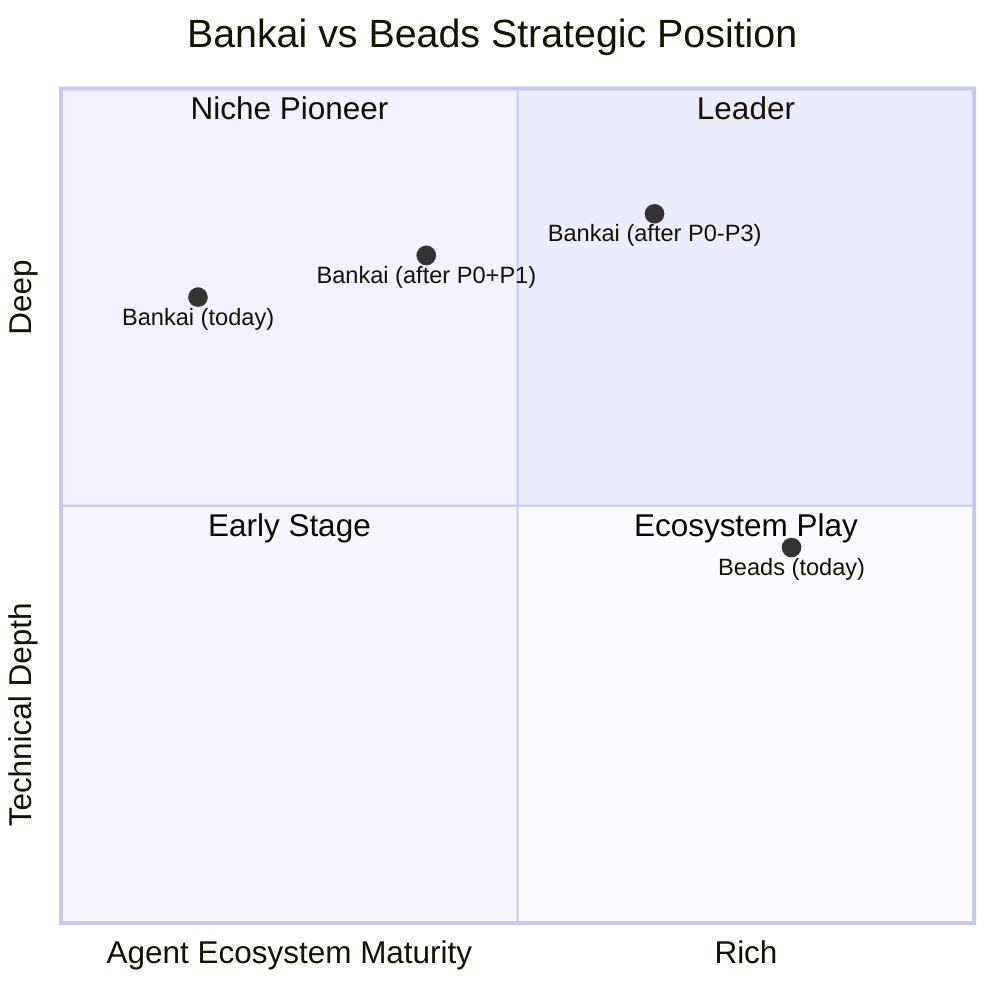

# Bankai vs Beads — Rich Hickey Gap Analysis

> "Programmers know the benefits of everything and the tradeoffs of nothing." — Rich Hickey
>
> This analysis asks: **What is Beads? What does bankai lack? What would each missing piece cost to build — and is it worth it?**

**Date:** 2026-08-03  
**Beads:** [gastownhall/beads](https://github.com/gastownhall/beads) — Go + Dolt, by Steve Yegge  
**Bankai:** [moneyacademyKE/bankai](https://github.com/moneyacademyKE/bankai) — Gleam + BEAM, content-addressed + mobile rules

---

## 1. Feature Set Comparison

### 1A. CLI Surface

| Command / Capability | Beads (`bd`) | Bankai (`bankai`) | Gap? |
|---|---|---|---|
| `init` — workspace setup | ✅ | ✅ | — |
| `create <title>` — new task | ✅ `-p 0` (priority flag) | ✅ (positional title only) | 🟡 No priority/label flags |
| `list` — all tasks | ✅ `--label`, `--title` filters | ✅ (unfiltered JSON array) | 🔴 No filtering |
| `ready` — unblocked work | ✅ `--label`, `--json` | ✅ (unfiltered) | 🟡 No filters |
| `update <id> <status>` | ✅ `--claim` (atomic assign + status) | ✅ (status only, no assign) | 🔴 No `--claim`, no assignee |
| `show <id>` — task detail + audit | ✅ Full audit trail, deps | ❌ (`inspect <hash>` by hash only) | 🔴 No `show` by id |
| `close <id>` — with reason | ✅ `--reason` | ❌ (`update <id> completed`) | 🟡 No close-reason |
| `dep add <child> <parent>` | ✅ CLI-driven | ❌ (actor API only, no CLI) | 🔴 No dep CLI |
| `prime` — agent context | ✅ + persistent memories | ✅ (static prompt only) | 🟡 No `remember` |
| `remember "insight"` | ✅ persistent memory | ❌ | 🔴 Missing |
| `compact` — memory decay | ✅ semantic summarization | ❌ | 🔴 Missing |
| `sync` — reconcile | ✅ Dolt push/pull, cell-level merge | 🟡 JSONL flush (local only) | 🔴 No remote sync |
| `serve` — daemon | ✅ (MCP server) | ✅ (UNIX socket JSON-RPC) | 🟡 No MCP |
| `setup <agent>` — agent integration | ✅ claude/codex/cursor/factory | ❌ | 🔴 Missing |
| `onboard` — print snippet | ✅ | ❌ | 🟡 Minor |
| `label add/remove` | ✅ | ❌ | 🔴 Missing |
| `search` / `query` — advanced filter | ✅ `--json`, `--label-any` | ❌ | 🔴 Missing |
| `dolt push/pull` — remote sync | ✅ | ❌ | 🔴 Missing |

---

### 1B. Data Model

| Aspect | Beads | Bankai | Gap? |
|---|---|---|---|
| Task identity | Hash-based short IDs (`bd-a3f8`) | Timestamp-based IDs (`bk-1722718555...`) | 🟡 IDs too long |
| Hierarchical IDs | ✅ `bd-a3f8.1.1` (epic → task → sub) | ❌ Flat namespace | 🔴 Missing |
| Assignee / claim | ✅ Atomic `--claim` | `Option(String)` field exists but not CLI-wired | 🟡 Data model ready, CLI gap |
| Labels / tags | ✅ First-class | ❌ | 🔴 Missing |
| Close reason | ✅ Required/supported | ❌ | 🟡 Missing |
| Relationship types | `blocks`, `related`, `parent-child`, `discovered-from`, `duplicates`, `supersedes`, `replies-to` | `Blocks`, `RelatesTo`, `Duplicates`, `Supersedes`, `RepliesTo` | 🟡 Missing `parent-child`, `discovered-from` |
| Message threading | ✅ `--thread`, ephemeral lifecycle | ❌ | 🔴 Missing |
| Content versioning | ✅ Dolt cell-level history | ✅ All versions in content-addressed store | ✅ Bankai's model is arguably stronger |

---

### 1C. Storage & Persistence

| Aspect | Beads | Bankai | Gap? |
|---|---|---|---|
| Local store | Dolt (SQL) + SQLite cache | In-memory dict + JSONL file | 🟡 No query engine |
| Persistence format | JSONL in `.beads/` + Dolt DB | JSONL in `.bankai/` | ✅ Same format |
| Git tracking | ✅ Committed to repo | ✅ (manual, no hooks) | 🟡 No auto-commit |
| Remote sync | ✅ Dolt remotes (push/pull) | ❌ JSONL-only, local | 🔴 Missing |
| Branching | ✅ Native Dolt branching | ❌ | 🔴 Missing |
| Cell-level merge | ✅ (Dolt) | Content-hash merge (all-or-conflict) | 🟡 Coarser merge |

---

### 1D. Agent Integration

| Aspect | Beads | Bankai | Gap? |
|---|---|---|---|
| `AGENTS.md` auto-generation | ✅ | ❌ | 🔴 Missing |
| `bd setup claude/codex/cursor` | ✅ Agent-specific hooks | ❌ | 🔴 Missing |
| MCP server | ✅ `beads-mcp` on PyPI | ❌ | 🔴 Missing |
| `--json` structured output | ✅ Every command | 🟡 Some commands output JSON, some plain text | 🟡 Inconsistent |
| Persistent memory (`remember`) | ✅ Injected into `prime` | ❌ | 🔴 Missing |
| Stealth mode | ✅ `--stealth` for non-git envs | ❌ | 🟡 Minor |
| Contributor mode | ✅ `--contributor` for forks | ❌ | 🟡 Minor |

---

### 1E. Unique to Bankai (Beads Lacks)

| Capability | Bankai | Beads |
|---|---|---|
| **Mobile rules** (pillar 2) — content-addressed executable code that syncs by hash | ✅ gleamunison eval + sandbox | ❌ |
| **OTP supervision tree** — crash recovery, per-task actor isolation | ✅ | ❌ (Go, no actor model) |
| **Warm daemon path** — resident BEAM VM, sub-5ms latency | ✅ UNIX socket JSON-RPC | 🟡 MCP server (slower) |
| **Canonical deterministic encoding** — cryptographic content identity | ✅ Versioned binary encoding | 🟡 Hash-based IDs but not full content-addressing |
| **Tamper detection** — `content_hash_valid()` verification | ✅ | ❌ |
| **Allow-list gated code execution** — ADR-0003 sandboxed eval | ✅ | ❌ |
| **BEAM fault tolerance** — process isolation, let-it-crash | ✅ | ❌ |

---

## 2. Feature Difference Explanations

### 🔴 Critical Gaps (bankai lacks, high impact)

| # | Gap | Why It Matters |
|---|---|---|
| G1 | **No `dep add` CLI** | The dependency graph — bankai's core differentiator — is only usable through the actor API. Agents can't `bankai dep add A B` from the command line. The graph is inert from the CLI. |
| G2 | **No `show <id>`** | Agents need to inspect a task by its human-readable id. `inspect <hash>` requires knowing the content hash, which changes on every update. |
| G3 | **No labels / filtering** | Agents can't scope `ready` or `list` to a label/priority. In a project with 50+ tasks, this is the difference between useful and useless. |
| G4 | **No `remember` / persistent memory** | Beads' killer agent feature. Agents lose project context across sessions. `remember` + `prime` injection solves the "50 First Dates" problem. |
| G5 | **No `compact` / memory decay** | As task count grows, `ready` output overwhelms the context window. Compaction summarizes old closed tasks. Without it, bankai's JSONL grows unbounded. |
| G6 | **No remote sync** | Beads syncs via Dolt remotes. Bankai's `sync` just flushes local JSONL — useless for multi-agent coordination across machines (its stated purpose). |
| G7 | **No agent setup / integration** | `bd setup claude` auto-configures hooks. Without this, agents must be manually instructed about bankai. |

### 🟡 Moderate Gaps

| # | Gap | Why It Matters |
|---|---|---|
| G8 | **No `--claim` atomic assign** | `update --claim` atomically sets assignee + status. Prevents race where two agents claim the same task. |
| G9 | **No `--json` flag consistency** | Some bankai commands return JSON, others plain text. Agents need parseable output from every command. |
| G10 | **No hierarchical IDs** | `bd-a3f8.1.1` is a natural epic → task → subtask breakdown. Flat `bk-<timestamp>` IDs don't support decomposition. |
| G11 | **No MCP server** | MCP is the emerging standard for AI tool integration. Without it, bankai can't plug into Claude Desktop, Cursor, etc. |
| G12 | **IDs are too long** | `bk-1722718555123456789` vs `bd-a3f8`. Humans and agents both suffer. |

---

## 3. Benefits & Tradeoffs

### What Bankai Gets Right That Beads Doesn't

| Advantage | Benefit | Tradeoff |
|---|---|---|
| **Mobile rules** (gleamunison) | Code travels between agents by content hash — no recompilation, no binary deployment. Novel. | Requires gleamunison runtime; limited to S-expression eval |
| **BEAM fault tolerance** | Per-task actor isolation. A crashed task can't take down the store. | Requires Erlang runtime on every machine |
| **True content-addressing** | Every task version is independently addressable by SHA-256. Tamper detection is built in. | Heavier hash computation; JSONL grows with every mutation |
| **Sub-5ms warm path** | Resident daemon avoids BEAM cold start cost. | Daemon must be running; socket files need cleanup |
| **Canonical encoding** | Deterministic binary encoding with version byte. Hash-stable across machines. | Any encoding change invalidates all existing hashes |

### What Beads Gets Right That Bankai Doesn't

| Advantage | Benefit | Tradeoff |
|---|---|---|
| **Dolt-powered SQL** | Full SQL queries, cell-level merge, native branching | Heavy dependency (Dolt binary); complex setup |
| **Memory compaction** | Agents don't drown in old tasks; context window stays clean | Summarization requires LLM call ($$); lossy |
| **Agent setup ecosystem** | One command to integrate with Claude/Codex/Cursor | Tight coupling to specific agents |
| **MCP server** | Standard protocol for AI tool integration | Another server process; MCP spec is still evolving |
| **Persistent `remember`** | Agents preserve insights across sessions | Accumulates; needs its own compaction |
| **Go binary distribution** | Single binary, cross-platform, `curl | bash` install | No actor model; no crash isolation |

---

## 4. Complexity vs Utility Analysis

| Gap | Utility (1-10) | Complexity (1-10) | Utility/Complexity | Verdict |
|---|---|---|---|---|
| G1 — `dep add` CLI | 9 | 2 | **4.5** | 🟢 **Build now** — trivial, unlocks core value |
| G2 — `show <id>` | 8 | 2 | **4.0** | 🟢 **Build now** — alias for `find_by_id` + JSON |
| G12 — Short IDs | 7 | 2 | **3.5** | 🟢 **Build now** — use hash prefix not timestamp |
| G9 — `--json` consistency | 7 | 3 | **2.3** | 🟢 **Build now** — standardize output wrapper |
| G8 — `--claim` | 8 | 3 | **2.7** | 🟢 **Build now** — wire assignee field |
| G3 — Labels/filtering | 8 | 5 | **1.6** | 🟢 **Build next** — add labels field + filter API |
| G4 — `remember` + inject | 9 | 4 | **2.3** | 🟢 **Build next** — separate memories JSONL + inject into prime |
| G10 — Hierarchical IDs | 6 | 5 | **1.2** | 🟡 **Consider** — parsing/generation logic |
| G7 — Agent setup | 7 | 6 | **1.2** | 🟡 **Consider** — per-agent config templates |
| G5 — Memory compaction | 8 | 8 | **1.0** | 🟡 **Defer** — requires LLM summarization |
| G6 — Remote sync | 9 | 9 | **1.0** | 🟡 **Defer** — gleamunison sync exists but needs wire protocol |
| G11 — MCP server | 6 | 7 | **0.9** | 🟡 **Defer** — MCP spec still evolving |

---

## 5. Weighted Recommendation — Power/Capabilities vs Speed vs Complexity vs Tradeoffs

### Scoring Methodology

Each gap scored on 4 axes (1-10 scale), then weighted:

- **Power** (40%): How much does closing this gap unlock for users?
- **Speed** (25%): How quickly can it be built?  
- **Low Complexity** (20%): How much ongoing maintenance burden?
- **Low Tradeoff** (15%): Does it compromise bankai's existing strengths?

| Gap | Power | Speed | Low Cmplx | Low Trade | **Weighted** | **Priority** |
|---|---|---|---|---|---|---|
| G1 — `dep add` CLI | 9 | 10 | 10 | 10 | **9.5** | **P0** |
| G2 — `show <id>` | 8 | 10 | 10 | 10 | **9.2** | **P0** |
| G12 — Short IDs | 7 | 9 | 9 | 8 | **8.0** | **P0** |
| G8 — `--claim` | 8 | 8 | 9 | 10 | **8.5** | **P0** |
| G9 — JSON consistency | 7 | 8 | 9 | 10 | **8.0** | **P0** |
| G4 — `remember` | 9 | 7 | 8 | 10 | **8.5** | **P1** |
| G3 — Labels/filters | 8 | 6 | 7 | 9 | **7.5** | **P1** |
| G10 — Hierarchical IDs | 6 | 5 | 6 | 7 | **5.9** | **P2** |
| G7 — Agent setup | 7 | 5 | 6 | 8 | **6.5** | **P2** |
| G5 — Memory compaction | 8 | 3 | 4 | 6 | **5.7** | **P3** |
| G6 — Remote sync | 9 | 2 | 3 | 5 | **5.3** | **P3** |
| G11 — MCP server | 6 | 3 | 4 | 6 | **4.8** | **P3** |

---

## 6. Actionable Recommendations

### Phase 1 — P0: "Make the graph usable" (est. 1-2 days)

> [!IMPORTANT]
> These 5 items are the minimum to make bankai competitive with Beads for single-agent workflows.

1. **G1** — Add `bankai dep add <task-id> <blocker-id>` CLI command  
2. **G2** — Add `bankai show <id>` (find by id, print JSON)  
3. **G12** — Generate short hash-prefix IDs (`bk-a3f8`) instead of timestamp IDs  
4. **G8** — Add `bankai update <id> --claim` (set assignee + in_progress atomically)  
5. **G9** — Wrap all command output in `{"ok": ...}` / `{"error": ...}` JSON envelopes  

### Phase 2 — P1: "Agent memory" (est. 2-3 days)

6. **G4** — Add `bankai remember "insight"` + inject memories into `prime` output  
7. **G3** — Add labels field to Task type + `--label` filter flag on `list`/`ready`  

### Phase 3 — P2: "Ecosystem" (est. 3-5 days)

8. **G10** — Support hierarchical IDs (`bk-a3f8.1`)  
9. **G7** — Add `bankai setup claude` / `bankai setup codex` (emit AGENTS.md)  

### Phase 4 — P3: "Scale" (est. 1-2 weeks)

10. **G5** — Memory compaction (summarize old closed tasks)  
11. **G6** — Remote sync via gleamunison/sync wire protocol  
12. **G11** — MCP server implementation  

---

## 7. Strategic Position

**Bankai's thesis is different from Beads':** Beads is an agent memory tool that happens to use hashes. Bankai is a content-addressed computation platform that happens to track tasks. The mobile rules (pillar 2) and BEAM fault tolerance are capabilities Beads cannot replicate without a fundamental rewrite.

> [!TIP]
> **The pragmatic path:** Close the P0 gaps (1-2 days of work) to reach feature parity on the CLI surface. Then the mobile rules + OTP supervision become a genuine differentiator rather than a "cool but unusable" foundation.

Bankai doesn't need to become Beads. It needs to become **usable enough** that its unique capabilities (mobile rules, actor isolation, cryptographic verification) can shine.
